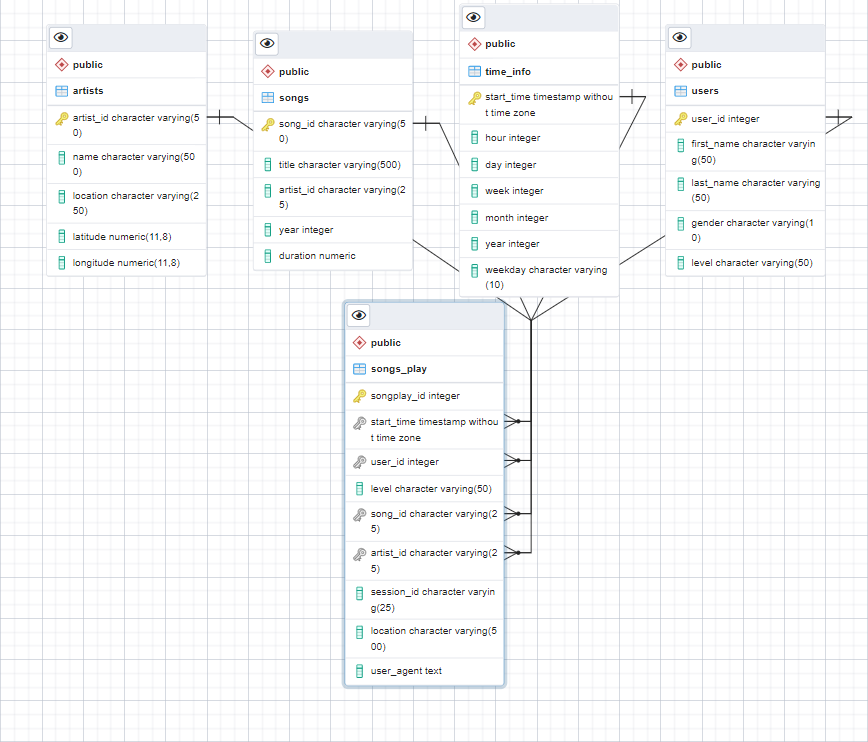

# Sparkify Data
## Overview
This project aims to design an OLAP database that can be used by the Sparkify data analytics team to understand the users that use their app for music streaming. 
The database that will be created by the project consist  four dimensional tables and a fact table.
## How to run the python script
### Install Dependencies
To run the scripts in the project first 
1. Download postgresql from https://www.postgresql.org/download/
2. Follow the installation setup instructions in the link https://www.guru99.com/download-install-postgresql.html
3. Follow the steps in the link below to install PGadmin. PgAdmin is a GUI Tool that help with the management of postgressql https://www.ktexperts.com/how-to-download-and-install-the-pgadmin-4/
4. In PGadmin create a user "student" with the password "student": this is to enable the program connect to the database.
Follow the steps in the link https://www.guru99.com/postgresql-create-alter-add-user.html to achieve this.

### Running the Script
1. run the create_tables.py to create the database and tables
2. run the etl.py to insert sample data into the database
3. Check the postgres db to confirm the creation of the table. Select top 5 rows to confirm the inser works well.

### Repository Files

#### DATA
The data folder contains two other folders that contains sample song data and data collected from users that use the sparkify application.

- data folder: contains all data that will be used in this project.
- Create_tables.py: this is a script that connects to the database in the configuration and creates five tables as specified in the script sql_queries.py  
The tables created are songplay, users, songs, artists, and time_info.
The create table will first drops all table with the same name that are in the connected database then creates the tables.

- sql_queries.py -: this script contains template of drop, create or select queries that are used in the project

- etl.py: the etl.py script connects to the database and inserts data into the five tables created.
- etl.ipynb: this is a notebook of the etl.py
- erd.pgerd : this is the entity relationship diagram of the table created by the create table file.

### Entity relationship Diagram of the database created

The ERD of the database

